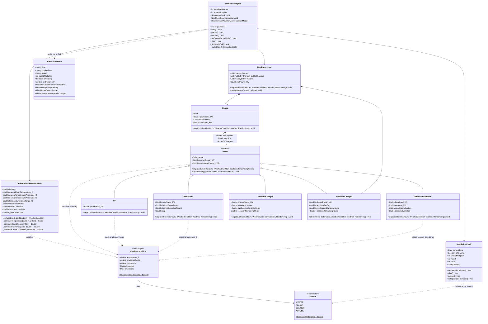

# Class Diagram: Neighbourhood Energy Simulation



## Key Design Decisions

### Inheritance over composition for assets
Each asset type extends a base `Asset` class because they share common accounting (power, cumulative energy) but have fundamentally different `step()` behaviour influenced by time, weather, and internal state.

### Asset.step() signature: `step(deltaTimeHours, weather, rng)`
Assets receive three parameters each tick:
- **`deltaTimeHours`** — the simulation step size in hours, for energy accounting
- **`weather`** — a `WeatherCondition` value object with temperature, irradiance, cloud cover, and season. Assets that don't respond to weather (e.g. EV chargers) simply ignore it.
- **`rng`** — the seeded PRNG function, for deterministic stochastic behaviour

This was designed from the start to accommodate weather (NFR5.1, NFR5.2).

### SimulationEngine tick sequence
Each tick the engine:
1. Advances the `SimulationClock` by `stepSizeMinutes`
2. Computes weather: `weatherModel.getWeather(clock.currentTime, rng)`
3. Steps the neighbourhood: recursively steps all houses (each steps its 4 assets) and public chargers
4. Records aggregate power history (rolling 24-hour window)
5. Builds and emits `SimulationState` via the `onTick` callback

### Public EV chargers at neighbourhood level
Public chargers belong to the neighbourhood (not houses) because they are shared infrastructure. Their usage model simulates independent random vehicle arrivals/departures.

### Base consumption as catch-all
`BaseConsumption` models all unmodeled household loads: ovens, lighting, electronics, dishwashers, etc. It is always present and non-negative, which guarantees that a house's total consumption always equals or exceeds the sum of its explicitly modeled assets (heat pump, EV charger) minus PV generation.

```
house.netPower = baseLoad.power + heatPump.power + evCharger.power - pv.power
                 \________ always-present base load ________/  \_ generation _/
```

### Weather model: deterministic, sinusoidal + PRNG noise
The `DeterministicWeatherModel` generates weather from the simulated date/time and the seeded PRNG — no external APIs. Temperature uses a sinusoidal annual curve (peak July, trough January) plus a diurnal curve (peak 14:00, trough 04:00) plus small PRNG noise. Irradiance uses solar geometry (declination, hour angle, latitude) attenuated by cloud cover. Cloud cover is a bounded random walk with seasonal bias and mean reversion.

### Seeded PRNG for full reproducibility
All randomness flows through a single seeded mulberry32 PRNG. The same seed + config + start time always produces identical results — simulation state, weather, and asset behaviour are fully deterministic.

### Server/UI: callback-based decoupling
The HTTP server (`server.js`) receives state via the engine's `onTick` callback and broadcasts to SSE clients. The engine has no knowledge of HTTP, SSE, or the browser. The server wraps the `onTick` callback — it does not import or depend on simulation internals beyond the `SimulationState` shape.
