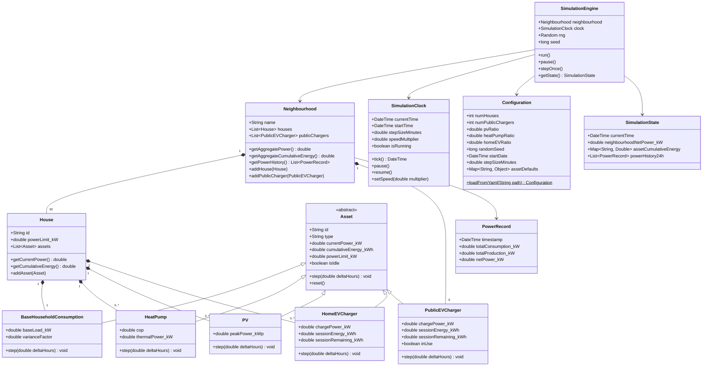

# Class Diagram: Neighbourhood Energy Simulation



## Key Design Decisions

### Inheritance over composition for assets
Each asset type extends a base `Asset` class because they share common accounting (power, cumulative energy, limits) but have fundamentally different `step()` behaviour influenced by time and internal state.

### Time-only step signature (weather deferred)
The `step(deltaHours)` signature keeps assets decoupled from weather for now. Weather and season influence will be added later — when introduced, assets will receive a `Weather` object in their `step()` call. This is a deliberate deferral, not a design limitation.

### SimulationEngine as orchestrator
The engine owns the clock and neighbourhood. Each tick it:
1. Advances the clock
2. Steps all assets across all houses and public chargers
3. Records aggregate power history
4. Publishes updated `SimulationState`

When weather is added later, step 1.5 will be "update weather from clock time".

### Public EV chargers at neighbourhood level
Public chargers belong to the neighbourhood (not houses) because they are shared infrastructure. Their usage model simulates random arrivals/departures of vehicles.

### Base household consumption as catch-all
The `BaseHouseholdConsumption` asset models *all* unmodeled household loads: ovens, lighting, electronics, dishwashers, etc. This is why a house's total consumption always equals or exceeds the sum of its explicitly modeled optional assets (heat pump, EV charger) — the base load is always present and non-negative.

```text
house.totalPower = baseLoad.power + heatPump.power + evCharger.power - pv.power
                                  \________ explicit optional assets ________/
```