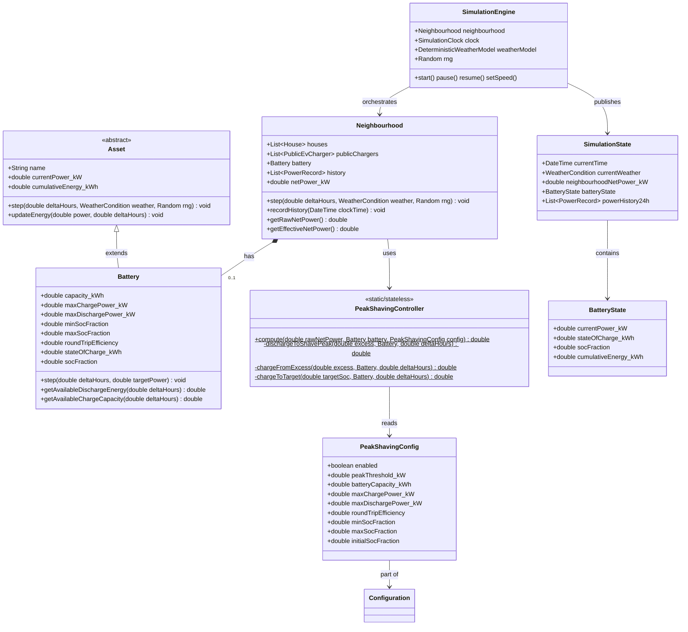

# Peak-Shaving Requirements

## Overview

This document specifies the peak-shaving subsystem for the Neighbourhood Energy Simulation. Peak-shaving reduces the maximum power drawn from the grid by deploying a neighbourhood-level battery that charges during low-demand periods (or excess solar generation) and discharges when net demand exceeds a configurable threshold.

The battery is a shared community asset — analogous to a "buurtbatterij" (neighbourhood battery) concept common in Dutch energy transition projects. It sits at the transformer level and smooths the aggregate load profile of all 30 houses and 6 public chargers.

Peak-shaving is **deterministic given weather + PRNG seed** — no new randomness is introduced. Battery behaviour is purely algorithmic: it responds to the net power signal and respects its physical constraints (capacity, charge/discharge rates, round-trip efficiency).

---

## Functional Requirements

### FR-P1: Battery Asset

1. **FR-P1.1** — The system must include a `Battery` asset type that extends the existing `Asset` base class.

2. **FR-P1.2** — The battery must track the following state:
    - `currentPower_kW` (double): positive when charging (consuming from grid), negative when discharging (supplying to grid)
    - `cumulativeEnergy_kWh` (double): net energy flow through the battery (charging = positive, discharging = negative)
    - `stateOfCharge_kWh` (double): current stored energy in kWh
    - `socFraction` (double): state of charge as a fraction [0, 1]

3. **FR-P1.3** — The battery must respect the following configurable limits:
    - `capacity_kWh` (double): total usable energy storage capacity
    - `maxChargePower_kW` (double): maximum charging power
    - `maxDischargePower_kW` (double): maximum discharging power
    - `minSocFraction` (double): minimum state of charge (default 0.10, i.e. 10%)
    - `maxSocFraction` (double): maximum state of charge (default 0.90, i.e. 90%)
    - `roundTripEfficiency` (double): efficiency factor applied during both charge and discharge (default 0.95 per direction, net 0.90 round-trip)

4. **FR-P1.4** — The battery must be instantiated at the **neighbourhood level** (one battery for the entire neighbourhood), not per house. This reflects the real-world deployment model of community batteries at the distribution transformer.

### FR-P2: Peak-Shaving Algorithm

1. **FR-P2.1** — Each simulation step, after all houses and public chargers have been stepped, the peak-shaving controller must:
    1. Compute the neighbourhood's **pre-battery net power**: `rawNetPower = sum(all houses) + sum(all public chargers)`
    2. Determine the desired battery action based on `rawNetPower` relative to `peakThreshold_kW`
    3. Apply the action within the battery's physical constraints
    4. Compute the **post-battery net power**: `effectiveNetPower = rawNetPower + batteryPower` (battery charging = positive, increases net load; discharging = negative, decreases net load)

2. **FR-P2.2** — The peak-shaving decision logic must follow these rules (evaluated in order):

    | Condition | Battery Action | Power Calculation |
    |-----------|---------------|-------------------|
    | `rawNetPower > peakThreshold_kW` | **Discharge** to shave the peak | `targetDischarge = min(rawNetPower - peakThreshold, maxDischargePower, availableEnergy / deltaTimeHours)` |
    | `rawNetPower < 0` (excess solar) | **Charge** from excess generation | `targetCharge = min(-rawNetPower, maxChargePower, availableCapacity / deltaTimeHours)` |
    | `0 <= rawNetPower <= peakThreshold_kW` and `socFraction < targetSoc` | **Charge** gently toward target SoC | `targetCharge = min(maxChargePower * 0.25, availableCapacity / deltaTimeHours)` (slow charge at 25% max rate) |
    | `0 <= rawNetPower <= peakThreshold_kW` and `socFraction >= targetSoc` | **Idle** | `power = 0` |

    where:
    - `availableEnergy = max(0, stateOfCharge_kWh - minSocFraction * capacity_kWh)` — energy available for discharge
    - `availableCapacity = max(0, maxSocFraction * capacity_kWh - stateOfCharge_kWh)` — headroom for charging
    - `targetSoc = 0.5 * (minSocFraction + maxSocFraction)` — midpoint of SoC range

3. **FR-P2.3** — After computing the target power, apply round-trip efficiency:
    - When charging: `actualStored = targetPower * deltaTimeHours * sqrt(efficiency)`
    - When discharging: `actualSupplied = targetPower * deltaTimeHours * sqrt(efficiency)`
    - This ensures the round-trip efficiency is `efficiency` (each direction gets sqrt(efficiency))

4. **FR-P2.4** — The battery must never exceed `minSocFraction` or `maxSocFraction` bounds. All target power calculations must be clamped to respect these limits.

5. **FR-P2.5** — The peak-shaving algorithm must be **deterministic**: it uses only the net power signal and battery state, no PRNG calls. Same weather + same seed = same peak-shaving behaviour.

### FR-P3: Configuration

1. **FR-P3.1** — Peak-shaving must be configurable via a `peakShaving` section in `config.yaml`.

2. **FR-P3.2** — Configuration parameters and their defaults:

    ```yaml
    peakShaving:
      enabled: true
      batteryCapacity_kWh: 500
      maxChargePower_kW: 250
      maxDischargePower_kW: 250
      peakThreshold_kW: 120
      roundTripEfficiency: 0.90
      minSocFraction: 0.10
      maxSocFraction: 0.90
      initialSocFraction: 0.50
    ```

3. **FR-P3.3** — If `enabled` is `false`, no battery is created and peak-shaving is skipped entirely. The `peakShaving` section itself must be optional (if absent, peak-shaving is disabled).

4. **FR-P3.4** — Sensible defaults must allow peak-shaving to be enabled by simply adding `peakShaving: { enabled: true }` to the config, with all other parameters defaulted.

### FR-P4: Energy Accounting Integration

1. **FR-P4.1** — The battery's `currentPower_kW` must be included in the neighbourhood's `netPower_kW`:
    ```
    neighbourhood.netPower_kW = sum(all houses) + sum(all public chargers) + battery.currentPower_kW
    ```
    Battery charging (positive power) → increases net load. Battery discharging (negative power) → decreases net load.

2. **FR-P4.2** — The battery's `cumulativeEnergy_kWh` must track net energy through the battery. This will be approximately zero over long periods (energy in ≈ energy out minus losses), but can drift due to efficiency losses and SoC target tracking.

3. **FR-P4.3** — The 24-hour power history must record the **effective** net power (post-battery), so the chart shows the shaved load profile.

### FR-P5: UI Display

1. **FR-P5.1** — The UI must display the battery state:
    - State of charge (kWh and percentage)
    - Current charge/discharge power (kW)
    - Visual indicator of charging vs discharging vs idle

2. **FR-P5.2** — The battery display must be positioned near the neighbourhood power gauge (it is a neighbourhood-level asset, not a house asset).

3. **FR-P5.3** — The gauge breakdown must distinguish battery contribution from houses and chargers.

### FR-P6: Interaction with Weather

1. **FR-P6.1** — Peak-shaving effectiveness varies realistically with weather:
    - **Cold winter days**: High heat pump demand → frequent peak threshold violations → battery discharges heavily
    - **Sunny summer days**: High PV generation → net power dips negative → battery charges from excess solar
    - **Cloudy winter days**: High demand + low PV → battery may deplete, limiting peak-shaving capacity
    - **Mild spring/autumn days**: Moderate demand → battery maintains target SoC with gentle charging

2. **FR-P6.2** — The battery's state of charge over time must reflect these seasonal patterns when viewed over multiple simulated days.

---

## Non-Functional Requirements

### NFR-P1: Determinism
1. **NFR-P1.1** — Peak-shaving must not introduce new randomness. Battery behaviour is purely algorithmic.
2. **NFR-P1.2** — Same seed + same config + same weather = identical battery behaviour and net power profile.

### NFR-P2: Performance
1. **NFR-P2.1** — Peak-shaving computation per simulation step must be O(1) — a few arithmetic operations and comparisons.
2. **NFR-P2.2** — Must not impact the simulation's ability to run at 3600x+ real-time.

### NFR-P3: Extensibility
1. **NFR-P3.1** — The peak-shaving controller must be separable from the battery model, so future algorithms (e.g., dynamic threshold, time-of-use tariff optimization) can replace it without changing the battery asset.
2. **NFR-P3.2** — The design must allow adding per-house batteries later without restructuring.

---

## Design Impact Analysis

### New Classes

| Class | Responsibility | Location |
|-------|---------------|----------|
| `Battery` | Energy storage asset extending `Asset`. Tracks SoC, enforces charge/discharge limits, applies efficiency. | `src/model/battery.js` |
| `PeakShavingController` | Pure function/logic class. Given `rawNetPower`, `batteryState`, and `config`, returns the target battery power for this step. Separated from `Battery` for testability. | `src/model/peak-shaving-controller.js` |

### Changed Classes

| Class | Change | Rationale |
|-------|--------|-----------|
| `Neighbourhood` | Gains an optional `Battery` member. `step()` calls `PeakShavingController` after stepping houses/chargers, then steps the battery. `netPower_kW` includes battery power. | Battery is a neighbourhood-level asset. |
| `SimulationEngine` | `_buildState()` includes battery state if peak-shaving is enabled. | UI needs battery state for display. |
| `Configuration` / `loader.js` | Parses optional `peakShaving` config section with defaults. | New config surface. |
| `config.yaml` | Adds `peakShaving` section. | Required for configuration. |
| `index.html` | Adds battery gauge/SOC display to the gauge container. | UI requirement. |

### SimulationEngine Tick Sequence (Updated)

```
1. Advance SimulationClock
2. Compute weather: weather = weatherModel.getWeather(clock.currentTime, rng)
3. Step all houses with (deltaHours, weather, rng)
4. Step all public chargers with (deltaHours, weather, rng)
5. Compute peak-shaving (new):
   a. rawNetPower = sum(houses) + sum(chargers)
   b. batteryTargetPower = PeakShavingController.compute(rawNetPower, battery, config)
   c. battery.step(deltaTimeHours, batteryTargetPower)
6. Record effective net power history (post-battery)
7. Publish SimulationState (now includes battery state)
```

### Updated Net Power Formula

```
Before peak-shaving:
  netPower = sum(house_i.netPower) + sum(charger_j.currentPower)

After peak-shaving:
  effectiveNetPower = netPower + battery.currentPower_kW
  where battery.currentPower_kW > 0 means charging (increases load)
  and   battery.currentPower_kW < 0 means discharging (reduces load)
```

---

## Class Diagram (Peak-Shaving Changes)



---

## Configuration Schema

```yaml
# config.yaml additions
peakShaving:
  enabled: true                    # Enable/disable peak-shaving
  batteryCapacity_kWh: 500         # Total usable battery capacity
  maxChargePower_kW: 250           # Maximum charging power
  maxDischargePower_kW: 250        # Maximum discharging power
  peakThreshold_kW: 120            # Power level above which to start discharging
  roundTripEfficiency: 0.90        # Round-trip efficiency (90% = 95% each way)
  minSocFraction: 0.10             # Minimum state of charge (10%)
  maxSocFraction: 0.90             # Maximum state of charge (90%)
  initialSocFraction: 0.50         # Starting state of charge (50%)
```

### Sizing Rationale

- **500 kWh capacity**: A typical Dutch neighbourhood battery for 30 houses. At an average household consumption of ~10 kWh/day, this provides roughly 1.5 hours of full neighbourhood backup or significant peak-shaving capacity.
- **250 kW charge/discharge**: Sized to handle the peak demand of 30 houses (each with 10 kW grid connection = 300 kW total, minus diversity factor). Can shave ~30% of peak load.
- **120 kW peak threshold**: Set at ~40% of maximum possible neighbourhood load. Peaks above this level trigger battery discharge. This threshold should be tuned based on the specific load profile.
- **10-90% SoC range**: Standard for lithium-ion batteries to preserve cycle life.

### State Export Schema (for API/UI)

```json
{
  "battery": {
    "currentPower_kW": -85.3,
    "stateOfCharge_kWh": 342.0,
    "socFraction": 0.684,
    "cumulativeEnergy_kWh": -12.5,
    "status": "discharging"
  }
}
```

---

## Test Requirements

| Test ID | Requirement | What it verifies |
|---------|-------------|------------------|
| T-P1 | FR-P1.3 | Battery enforces SoC bounds: cannot charge past maxSoC, cannot discharge below minSoC |
| T-P2 | FR-P2.2 | Battery discharges when net power exceeds peak threshold |
| T-P3 | FR-P2.2 | Battery charges from excess solar when net power is negative |
| T-P4 | FR-P2.2 | Battery slowly charges toward target SoC during moderate load |
| T-P5 | FR-P2.2 | Battery idles when at target SoC and net power is below threshold |
| T-P6 | FR-P1.3 | Charge/discharge power respects maxChargePower_kW and maxDischargePower_kW limits |
| T-P7 | FR-P1.3 | Round-trip efficiency is correctly applied (charge 100 kWh, discharge ~90 kWh) |
| T-P8 | FR-P4.1 | Neighbourhood net power includes battery contribution |
| T-P9 | NFR-P1.2 | Same seed + config produces identical peak-shaving behaviour across two runs |
| T-P10 | FR-P6.1 | Battery SoC reflects seasonal weather patterns over a simulated week |

---

## Implementation Notes

### Battery.step() Design

Unlike other assets, `Battery.step()` does not use weather or PRNG. It receives a pre-computed `targetPower` from the `PeakShavingController`:

```js
step(deltaTimeHours, targetPower_kW) {
  // Apply SoC constraints
  const maxCharge = this.getAvailableChargeCapacity() / deltaTimeHours;
  const maxDischarge = this.getAvailableDischargeEnergy() / deltaTimeHours;

  let power = targetPower_kW;
  if (power > 0) power = Math.min(power, maxCharge, this.maxChargePower_kW);
  if (power < 0) power = Math.max(power, -maxDischarge, -this.maxDischargePower_kW);

  // Apply efficiency
  const efficiencyFactor = Math.sqrt(this.roundTripEfficiency);
  if (power > 0) {
    this.stateOfCharge_kWh += power * deltaTimeHours * efficiencyFactor;
  } else {
    this.stateOfCharge_kWh += power * deltaTimeHours / efficiencyFactor;
  }

  this.currentPower_kW = power;
}
```

This is intentionally different from the standard `Asset.step(deltaTimeHours, weather, rng)` signature. The battery is controlled by the peak-shaving algorithm, not by weather or randomness directly. This design keeps the controller logic testable independently of the battery model.

### Why Neighbourhood-Level Battery?

1. **Realism**: Community batteries ("buurtbatterijen") are deployed at the transformer level in Dutch pilot projects (e.g., in Heeten, Amsterdam).
2. **Simplicity**: One battery with one controller is easier to reason about and visualize than 30 distributed batteries.
3. **Effectiveness**: Peak-shaving at the aggregate level directly addresses grid congestion at the transformer — the primary motivation for peak-shaving.

Per-house batteries (for self-consumption optimization) are a separate concern and can be added later under the same `Battery` class.

### Interaction with Existing Power Limit

Houses already have a `powerLimit_kW` (default 10 kW) that caps their grid connection. The peak-shaving battery operates *above* this level — it reduces the neighbourhood's aggregate draw from the grid but does not change individual house limits. The battery effectively provides headroom so that houses can exceed their individual limits momentarily without the transformer seeing the peak.

---

## Files Touched (Summary)

| File | Action |
|------|--------|
| `src/model/battery.js` | **CREATE** — Battery asset class |
| `src/model/peak-shaving-controller.js` | **CREATE** — Peak-shaving algorithm |
| `src/model/neighbourhood.js` | EDIT — Add battery, integrate peak-shaving into `step()` |
| `src/simulation/engine.js` | EDIT — Include battery state in `_buildState()` |
| `src/config/loader.js` | EDIT — Parse `peakShaving` config section |
| `config.yaml` | EDIT — Add `peakShaving` section |
| `src/ui/index.html` | EDIT — Add battery display to gauge area |
| `test/peak-shaving.test.js` | **CREATE** — 10 test cases (T-P1 through T-P10) |

---

## Verification

1. `npm test` — All existing + new peak-shaving tests pass
2. `npm start` — Simulation runs, UI shows battery SoC and charge/discharge power
3. At high speed, battery SoC visibly fluctuates with daily load/solar patterns
4. Peak-shaving reduces maximum observed net power compared to a run with `enabled: false`
5. Same seed + config = identical battery behaviour across restarts
