# Weather and Season Requirements

## Overview

This document specifies the weather and season subsystem for the Neighbourhood Energy Simulation. Weather and season were intentionally deferred in the initial design (see `Requirements.md` "Deferred: Weather and Season"). This document defines the model, its influence on assets, the integration points with the existing architecture, and the data format.

Weather is generated **deterministically** from the simulated date/time and the seeded PRNG — no external APIs or real weather data are required. The same seed + config always produces the same weather sequence.

---

## Functional Requirements

### FR-W1: Weather Model

1. **FR-W1.1** — The system must represent weather with at minimum the following variables:
    - `temperature_C` (double): ambient air temperature in degrees Celsius
    - `irradianceFactor` (double): normalised irradiance multiplier in range [0.0, 1.0], where 0.0 = no useful sunlight (night or heavy overcast) and 1.0 = clear-sky peak irradiance for that date/time
    - `cloudCover` (double): cloud cover fraction in range [0.0, 1.0], where 0.0 = clear sky and 1.0 = fully overcast

2. **FR-W1.2** — Weather must be generated deterministically: same simulated date/time + same PRNG seed must produce the same weather values.

3. **FR-W1.3** — Weather must not require external services or APIs.

### FR-W2: Season Model

1. **FR-W2.1** — The system must derive the current season from the simulated month:
    - **Winter**: December, January, February
    - **Spring**: March, April, May
    - **Summer**: June, July, August
    - **Autumn**: September, October, November

2. **FR-W2.2** — Season must be queryable as an enum value (`WINTER`, `SPRING`, `SUMMER`, `AUTUMN`).

3. **FR-W2.3** — Season must influence the underlying weather generation (temperature baseline, day-length, base irradiance).

### FR-W3: Temperature Model

1. **FR-W3.1** — Temperature must follow a realistic seasonal and diurnal (daily) pattern.

2. **FR-W3.2** — Temperature is computed as:
    ```
    temperature_C = T_seasonal(dayOfYear) + T_diurnal(hourOfDay) + T_noise
    ```
    where:
    - `T_seasonal` is a sinusoidal annual curve with a peak in mid-July and trough in mid-January
    - `T_diurnal` is a sinusoidal daily curve with a peak at ~14:00 local time and trough at ~04:00
    - `T_noise` is small deterministic jitter derived from the PRNG (range: -1.5 to +1.5 deg C)

3. **FR-W3.3** — Temperature must use realistic Dutch/North-West European parameters by default:
    - Annual mean: ~10 deg C
    - Annual amplitude: ~7 deg C (summer peak ~17 deg C, winter trough ~3 deg C)
    - Diurnal amplitude: ~5 deg C peak-to-peak
    - These parameters must be configurable in the YAML configuration file.

### FR-W4: Irradiance Model

1. **FR-W4.1** — Irradiance must follow a realistic solar geometry model:
    - Solar elevation angle computed from latitude, day-of-year, and hour-of-day
    - Irradiance is zero when the sun is below the horizon (night-time)
    - Base clear-sky irradiance is proportional to the sine of the solar elevation angle

2. **FR-W4.2** — The `irradianceFactor` is computed as:
    ```
    irradianceFactor = clearSkyIrradiance * cloudAttenuation * seasonalityFactor
    ```
    where:
    - `clearSkyIrradiance` = max(0, sin(solarElevationAngle)) * sunStrength(dayOfYear)
    - `cloudAttenuation` = 1.0 - cloudCover (clouds reduce irradiance)
    - `seasonalityFactor` accounts for sun-earth distance variation (optional, nominal 1.0)

3. **FR-W4.3** — Cloud cover must transition smoothly over time using a deterministic random walk (not jump discontinuously each step), so PV output varies realistically.

### FR-W5: Cloud Cover Model

1. **FR-W5.1** — Cloud cover must vary realistically:
    - Seasonal bias: winter tends cloudier, summer tends clearer (configurable)
    - Persistence: cloud cover changes gradually (random walk with configurable step size)
    - Bounded to [0.0, 1.0]

2. **FR-W5.2** — Cloud cover is updated each simulation step via:
    ```
    cloudCover = clamp(cloudCover + randomWalkStep, 0.0, 1.0)
    ```

### FR-W6: Weather Influence on PV Production

1. **FR-W6.1** — PV panel power output must be proportional to `irradianceFactor`:
    ```
    pvPower_kW = peakPower_kWp * irradianceFactor
    ```
    where `peakPower_kWp` is the installed capacity in kilowatt-peak.

2. **FR-W6.2** — PV production must be zero at night (irradianceFactor = 0 when sun below horizon).

3. **FR-W6.3** — PV production must be reduced by cloud cover via the irradiance factor.

### FR-W7: Weather Influence on Heat Pump Consumption

1. **FR-W7.1** — Heat pump power consumption must be proportional to the heating demand, which is driven by the difference between a target indoor temperature and the outdoor temperature:
    ```
    heatingDemand = max(0, T_indoor_target - T_outdoor)
    hpPower_kW = min(heatingDemand * thermalLossCoefficient / cop, powerLimit_kW)
    ```
    where:
    - `T_indoor_target` = 20.0 deg C (configurable)
    - `T_outdoor` = weather.temperature_C
    - `thermalLossCoefficient` = building heat loss rate in kW/K (configurable, default ~0.15 kW/K)
    - `cop` = coefficient of performance (configurable, default ~3.5)

2. **FR-W7.2** — Heat pump must idle when outdoor temperature exceeds the target indoor temperature (no heating demand).

3. **FR-W7.3** — Heat pump consumption must increase as outdoor temperature drops, reflecting higher heat loss from the building.

### FR-W8: Weather Influence on Base Household Consumption

1. **FR-W8.1** — Base household load may optionally vary by time-of-day and season:
    - Higher in evenings (lighting, cooking, entertainment)
    - Higher in winter (more indoor activity, lighting)
    - Lower at night (sleeping hours)
    - This is configurable and defaults to a modest effect (e.g., 20% variation).

2. **FR-W8.2** — This influence is optional and may be disabled in configuration.

---

## Non-Functional Requirements

### NFR-W1: Determinism
1. **NFR-W1.1** — Weather generation must use the same seeded PRNG as the rest of the simulation.
2. **NFR-W1.2** — Identical seed + config + start date must produce identical weather sequences.

### NFR-W2: Configuration
1. **NFR-W2.1** — Weather model parameters must be configurable via the YAML configuration file under a `weather` key.
2. **NFR-W2.2** — Sensible defaults must be provided so the `weather` configuration section is optional.

### NFR-W3: Performance
1. **NFR-W3.1** — Weather computation per simulation step must be O(1) and fast enough to not bottleneck the simulation at 3600x real-time.

### NFR-W4: Extensibility
1. **NFR-W4.1** — The `WeatherCondition` object must be designed so additional weather variables (wind speed, humidity, etc.) can be added without breaking the existing `step()` signature.
2. **NFR-W4.2** — The weather generation algorithm must be swappable (e.g., to plug in real weather data later) via a common `WeatherModel` interface.

---

## Weather Data Format

The `WeatherCondition` value object carries the weather state at a given simulation time step. Below is an example of realistic output across a summer and winter day:

### Example: Summer Day (15 July, clear)

| Time   | Temp (deg C) | Cloud Cover | Irradiance Factor | Season |
|--------|-------------|-------------|-------------------|--------|
| 00:00  | 13.2        | 0.15        | 0.00              | SUMMER |
| 04:00  | 10.8        | 0.12        | 0.00              | SUMMER |
| 08:00  | 16.5        | 0.10        | 0.42              | SUMMER |
| 12:00  | 21.3        | 0.08        | 0.91              | SUMMER |
| 14:00  | 22.7        | 0.11        | 0.87              | SUMMER |
| 16:00  | 21.9        | 0.14        | 0.63              | SUMMER |
| 20:00  | 18.4        | 0.18        | 0.11              | SUMMER |
| 23:00  | 15.1        | 0.20        | 0.00              | SUMMER |

### Example: Winter Day (15 January, overcast)

| Time   | Temp (deg C) | Cloud Cover | Irradiance Factor | Season |
|--------|-------------|-------------|-------------------|--------|
| 00:00  | 1.8         | 0.72        | 0.00              | WINTER |
| 04:00  | 0.3         | 0.78        | 0.00              | WINTER |
| 08:00  | 1.1         | 0.81        | 0.03              | WINTER |
| 12:00  | 4.2         | 0.75        | 0.21              | WINTER |
| 14:00  | 5.1         | 0.73        | 0.18              | WINTER |
| 16:00  | 3.8         | 0.76        | 0.04              | WINTER |
| 20:00  | 2.1         | 0.80        | 0.00              | WINTER |
| 23:00  | 1.5         | 0.77        | 0.00              | WINTER |

### JSON Schema for WeatherCondition (for API/state export)

```json
{
  "timestamp": "2025-01-15T14:00:00",
  "temperature_C": 5.1,
  "irradianceFactor": 0.18,
  "cloudCover": 0.73,
  "season": "WINTER"
}
```

The `WeatherCondition` is included in the `SimulationState` export so the UI can display weather context.

---

## Design Impact Analysis

### New Classes

| Class | Responsibility |
|-------|---------------|
| `Season` (enum) | Enumeration: `WINTER`, `SPRING`, `SUMMER`, `AUTUMN`. Derived from month. |
| `WeatherCondition` (value object) | Immutable snapshot of weather at one time step: `temperature_C`, `irradianceFactor`, `cloudCover`, `season`. |
| `WeatherModel` (interface) | Contract: `getWeather(DateTime, Random) -> WeatherCondition`. Allows swapping implementations. |
| `DeterministicWeatherModel` | Default implementation using sinusoidal seasonal/diurnal curves + PRNG for cloud and noise. |

### Changed Classes

| Class | Change | Rationale |
|-------|--------|-----------|
| `Asset` (abstract) | `step(deltaHours)` → `step(deltaHours, weather: WeatherCondition)` | Assets need weather context for realistic behaviour. WeatherCondition is a value object so assets that don't use weather can ignore it. |
| `BaseHouseholdConsumption` | `step()` accepts weather; optionally modulates base load by time-of-day and season | Provides realistic load variation (higher evenings, higher winter). |
| `HeatPump` | `step()` uses `weather.temperature_C` to compute heating demand | Temperature is the primary driver of heat pump consumption. |
| `PV` | `step()` uses `weather.irradianceFactor` to modulate production | Replaces random variation with physically-grounded irradiance model. |
| `SimulationEngine` | Adds `WeatherModel` dependency; inserts a weather-update step before stepping assets each tick | Weather must be computed once per tick before assets are stepped. |
| `SimulationState` | Adds `WeatherCondition currentWeather` field | UI needs weather context for display. |
| `Configuration` | Adds optional `weather` section with model parameters | Allows tuning of temperature baseline, amplitude, cloud persistence, latitude, etc. |

### SimulationEngine Tick Sequence (Updated)

```
1. Advance SimulationClock
2. Update Weather: weather = weatherModel.getWeather(clock.currentTime, rng)
3. Step all assets with (deltaHours, weather):
   a. For each House:
      - Step BaseHouseholdConsumption
      - Step HeatPump(s)
      - Step PV(s)
      - Step HomeEVCharger(s)
   b. For each PublicEVCharger:
      - Step PublicEVCharger
4. Record aggregate power history
5. Publish SimulationState (now includes weather)
```

### Asset.step() Signature Change

The signature change from `step(deltaHours)` to `step(deltaHours, weather)` is a **breaking change** to the Asset abstract class and all subclasses. However, it was anticipated in the initial design (NFR5.1, NFR5.2) and in the class diagram notes ("When introduced, assets will receive a Weather object in their step() call").

Assets that do not respond to weather (e.g., EV chargers) simply ignore the parameter. Assets that do respond (PV, HeatPump, BaseHouseholdConsumption) use the relevant fields.

### YAML Configuration Additions

```yaml
weather:
  latitude: 52.0                    # deg N (Netherlands default)
  annualMeanTemperature_C: 10.0     # annual mean
  annualTemperatureAmplitude_C: 7.0 # summer-winter swing
  diurnalTemperatureAmplitude_C: 5.0# day-night swing
  temperatureNoiseRange_C: 1.5      # max jitter
  indoorTargetTemperature_C: 20.0   # target for heat pump
  cloudPersistence: 0.02            # max random walk step per minute
  winterCloudBias: 0.3              # added cloud base in winter
  summerCloudBias: -0.1             # subtracted cloud base in summer
  enableBaseLoadModulation: true    # time/season influence on base load
  baseLoadSeasonalVariation: 0.2    # 20% seasonal variation
```

---

## Class Diagram (Weather and Season Changes)

```mermaid
classDiagram
    direction TB

    %% ── New types ──────────────────────────────────────────

    class Season {
        <<enumeration>>
        WINTER
        SPRING
        SUMMER
        AUTUMN
    }

    class WeatherCondition {
        <<value object>>
        +double temperature_C
        +double irradianceFactor
        +double cloudCover
        +Season season
        +DateTime timestamp
    }

    class WeatherModel {
        <<interface>>
        +getWeather(DateTime time, Random rng) WeatherCondition
    }

    class DeterministicWeatherModel {
        -double latitude
        -double annualMeanTemp_C
        -double annualAmplitude_C
        -double diurnalAmplitude_C
        -double noiseRange_C
        -double cloudPersistence
        -double winterCloudBias
        -double summerCloudBias
        -double lastCloudCover
        +getWeather(DateTime time, Random rng) WeatherCondition
        -computeTemperature(DateTime) double
        -computeSolarElevation(DateTime) double
        -computeCloudCover(DateTime, Random) double
        -computeIrradianceFactor(DateTime, double, double) double
        -deriveSeason(DateTime) Season
    }

    %% ── Changed existing classes ───────────────────────────

    class Asset {
        <<abstract>>
        +String id
        +String type
        +double currentPower_kW
        +double cumulativeEnergy_kWh
        +double powerLimit_kW
        +boolean isIdle
        +step(double deltaHours, WeatherCondition weather) void
        +reset()
    }

    class PV {
        +double peakPower_kWp
        +step(double deltaHours, WeatherCondition weather) void
    }

    class HeatPump {
        +double cop
        +double thermalLossCoefficient
        +step(double deltaHours, WeatherCondition weather) void
    }

    class BaseHouseholdConsumption {
        +double baseLoad_kW
        +double varianceFactor
        +boolean seasonalModulationEnabled
        +step(double deltaHours, WeatherCondition weather) void
    }

    class HomeEVCharger {
        +double chargePower_kW
        +double sessionEnergy_kWh
        +double sessionRemaining_kWh
        +step(double deltaHours, WeatherCondition weather) void
    }

    class PublicEVCharger {
        +double chargePower_kW
        +double sessionEnergy_kWh
        +double sessionRemaining_kWh
        +boolean inUse
        +step(double deltaHours, WeatherCondition weather) void
    }

    class SimulationEngine {
        +Neighbourhood neighbourhood
        +SimulationClock clock
        +WeatherModel weatherModel
        +Random rng
        +long seed
        +run()
        +pause()
        +stepOnce()
        +getState() SimulationState
    }

    class SimulationState {
        +DateTime currentTime
        +WeatherCondition currentWeather
        +double neighbourhoodNetPower_kW
        +Map~String, Double~ assetCumulativeEnergy
        +List~PowerRecord~ powerHistory24h
    }

    class Configuration {
        +int numHouses
        +int numPublicChargers
        +double pvRatio
        +double heatPumpRatio
        +double homeEVRatio
        +long randomSeed
        +DateTime startDate
        +double stepSizeMinutes
        +Map~String, Object~ assetDefaults
        +WeatherConfig weatherConfig
        +loadFromYaml(String path) Configuration$
    }

    class WeatherConfig {
        +double latitude
        +double annualMeanTemperature_C
        +double annualTemperatureAmplitude_C
        +double diurnalTemperatureAmplitude_C
        +double temperatureNoiseRange_C
        +double indoorTargetTemperature_C
        +double cloudPersistence
        +double winterCloudBias
        +double summerCloudBias
        +boolean enableBaseLoadModulation
        +double baseLoadSeasonalVariation
    }

    %% ── Unchanged (shown for context) ──────────────────────

    class Neighbourhood {
        +String name
        +List~House~ houses
        +List~PublicEVCharger~ publicChargers
        +getAggregatePower() double
        +getAggregateCumulativeEnergy() double
        +getPowerHistory() List~PowerRecord~
    }

    class SimulationClock {
        +DateTime currentTime
        +DateTime startTime
        +double stepSizeMinutes
        +double speedMultiplier
        +boolean isRunning
        +tick() DateTime
        +pause()
        +resume()
    }

    %% ── Relationships ──────────────────────────────────────

    WeatherModel <|-- DeterministicWeatherModel
    DeterministicWeatherModel ..> WeatherCondition : creates
    DeterministicWeatherModel ..> Season : derives
    WeatherCondition --> Season : uses

    Asset <|-- PV
    Asset <|-- HeatPump
    Asset <|-- BaseHouseholdConsumption
    Asset <|-- HomeEVCharger
    Asset <|-- PublicEVCharger

    SimulationEngine --> WeatherModel : uses
    SimulationEngine --> SimulationState : publishes
    SimulationEngine --> Configuration : reads
    SimulationState --> WeatherCondition : contains

    Configuration --> WeatherConfig : contains

    Asset ..> WeatherCondition : receives in step()
    PV ..> WeatherCondition : reads irradianceFactor
    HeatPump ..> WeatherCondition : reads temperature_C
    BaseHouseholdConsumption ..> WeatherCondition : reads season, time
```



---

## Implementation Notes

### Temperature Formula

```
dayOfYear        = dateTime.dayOfYear()           // 1..365
hourOfDay        = dateTime.hour + dateTime.minute / 60.0

// Seasonal: peak at day 198 (~17 July), trough at day 15 (~15 Jan)
T_seasonal       = annualAmplitude * sin(2*PI * (dayOfYear - 80) / 365)

// Diurnal: peak at 14:00, trough at 04:00
T_diurnal        = (diurnalAmplitude / 2) * sin(2*PI * (hourOfDay - 8) / 24)

// Noise: small deterministic jitter
T_noise          = (rng.nextDouble() - 0.5) * 2 * noiseRange

temperature_C    = annualMean + T_seasonal + T_diurnal + T_noise
```

### Solar Elevation Formula

```
declination      = 23.45 * sin(2*PI * (284 + dayOfYear) / 365)   // degrees
hourAngle        = 15 * (hourOfDay - 12)                          // degrees
sinElevation     = sin(lat_rad) * sin(dec_rad) + cos(lat_rad) * cos(dec_rad) * cos(ha_rad)
elevation        = asin(sinElevation)                             // radians
```

### Cloud Cover Random Walk

```
seasonalBias     = season == WINTER ? winterCloudBias : season == SUMMER ? summerCloudBias : 0
targetCloudBase  = clamp(0.5 + seasonalBias, 0.0, 1.0)
drift            = (rng.nextDouble() - 0.5) * 2 * cloudPersistence * deltaMinutes
cloudCover       = clamp(lastCloudCover + drift, 0.0, 1.0)
```

### Season Derivation

```
month = dateTime.month()
Season = month in {12, 1, 2} -> WINTER
         month in {3, 4, 5}  -> SPRING
         month in {6, 7, 8}  -> SUMMER
         month in {9, 10, 11}-> AUTUMN
```

---

## Test Requirements

1. **T-W1** — `Season` derivation: verify correct season for boundary dates (1 Dec, 28 Feb, 1 Mar, 31 May, 1 Jun, 31 Aug, 1 Sep, 30 Nov).
2. **T-W2** — Temperature model: verify seasonal peak in July, trough in January.
3. **T-W3** — Irradiance factor: verify zero at night, non-zero during day, reduced by high cloud cover.
4. **T-W4** — Determinism: verify two `WeatherModel` instances with the same seed produce identical sequences.
5. **T-W5** — PV integration: verify `pvPower = peakPower * irradianceFactor`.
6. **T-W6** — Heat pump integration: verify higher consumption at lower temperatures, zero consumption when T_outdoor >= T_indoor_target.
7. **T-W7** — Cloud cover bounds: verify cloud cover stays in [0.0, 1.0] over a full year simulation.
8. **T-W8** — Simulation state includes current weather after each tick.
